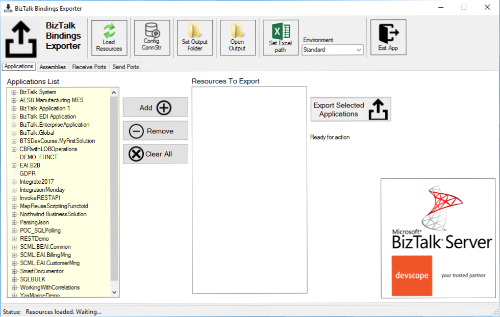

# BizTalk Bindings Exporter tool
“BizTalk Binding Exporter Tool” is a simple tool that you can use to easily export a binding file from BizTalk Applications.

Exporting a BizTalk Server Application binding is, at first sight, a simple and quick task that can be done using the BizTalk Server Administration Console. But even in simple tasks, we may encounter challenges that require us to perform some monotonous and boring manual operations that consume some of our precious time and are always subject to failures.

Normally the binding exportation starts in development, but we also will need to generate the same bindings for other environemnts like production and for that we normally need to open the binding file and replace/fix the differences for each different environment… which is normally a tedious operation. What we need to replace is mainly:
* **the URI’s**: it should be fixed, but it is not mandatory. If you know what you are doing, you can fix them directly on the environment after you import the Binding.
* **the host instances**: not mandatory, if you have the same host and host instances names across all your different environments (as best practices will tell you to do).
* **the NT Group Name associated in the Services (Orchestrations)**: according to securities best practices you shouldn’t use the same BizTalk Groups in different environments, so in this case, if you follow this best practices, you need to change these parameters in your binding file.

Normally, everyone changes the URI’s but neglecting the other parameters may be causing problems during the Binding import.

This tool will extend default BizTalk Server capabilities transforming the tedious and sometimes complicate binding generation a little simple and easy. 

# Description
This tool allows you to generate and export binding files with the following capabilities:
* Export binding(s) file(s) for an entire Application or a list of Applications;
* Export binding(s) file(s) from a specify Assembly or list of Assemblies;
* Export binding(s) file(s) from a Receive Port or list of Receive Ports;
* Export binding(s) file(s) from a Send Port or list of Send Ports;
* Generate different binding files for each environement;
 

# About US
**Sandro Pereira** | [DevScope](http://www.devscope.net/) | MVP & MCTS BizTalk Server 2010 | [https://blog.sandro-pereira.com/](https://blog.sandro-pereira.com/) | [@sandro_asp](https://twitter.com/sandro_asp)
**Pedro Almeida** | [DevScope](http://www.devscope.net/) | Integration Developer 